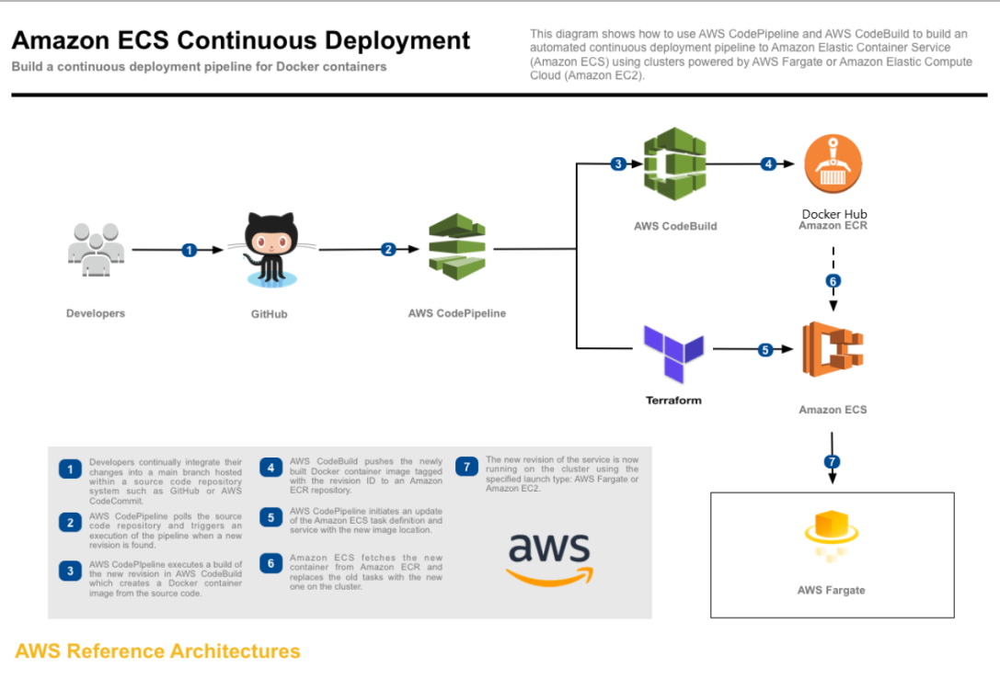

# Architecture
The AWS solution is depicted in the diagram below.

With this project you can create 2 ECS code pipelines:
1) The INFRA pipeline can be used to create the necessary infrastructure (VPC, security groups, ECS, Fargate) using terraform and do the new application deployments also using terraform.
2) the APP pipeline can be used to build the application docker image and push it into ECR or Docker Hub.

When the second pipeline has finished with building the application docker image, it should then trigger the first pipeline in order to deploy the newly created docker image.
To trigger a new deployment of an ECS task definition a BUILD_ID is introduced in the task definition task and as an environment variable. This is a workaround because the origional ECS task definition can use the tag "latest" in the image name.

# Deployment Instructions
Use the shell scripts provided in the root of the project