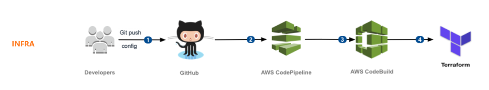
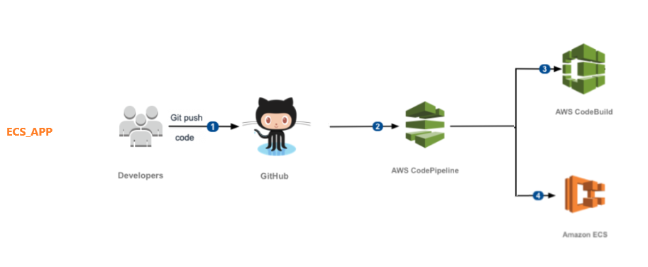
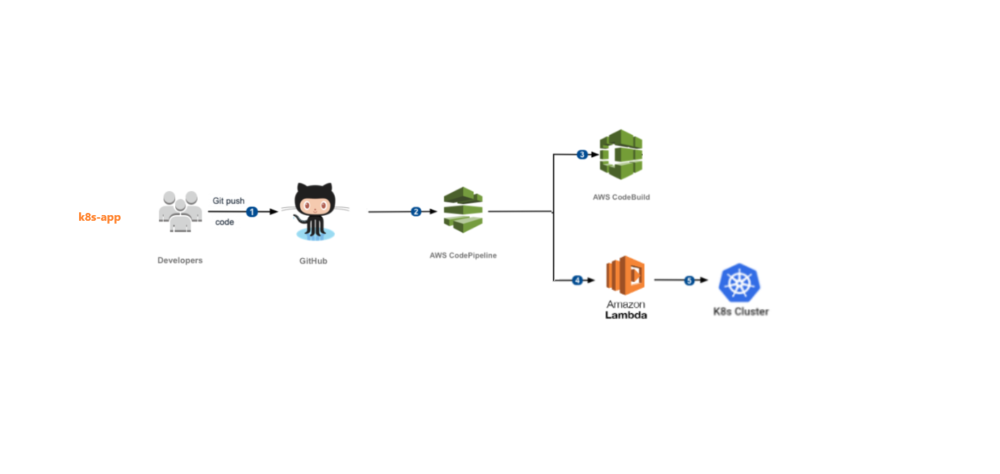

# Architecture
With this project you can create 3 different template CI/CD pipelines ('infra', 'ecs-app', 'k8s-app').

# 1. infra CI/CD pipeline

##### Summary
Build the infra infrastructure by using Terraform. Terraform will allow a wide variety of resources to be deployed. In the CodeBuild buildspec.yml file of the plugged in project the necessary Terraform commands need to be provided. CodePipeline will orchestrate the workflow.



##### Example to deploy this CI/CD pipeline
```
type=infra repo_owner=roeldenblanken repo_name=ecs-fargate-example repo_default_branch=master ./terraform-apply-code-pipeline.sh 
```

# 2. ecs-app CI/CD pipeline

##### Summary
Build the docker image and push it to a docker repo via CodeBuild. Post-steps invoke an ECS deployment also via CodeBuild. This logic has to be provided in the buildspec.yml file in the corresponding app project. CodePipeline will orchestrate the workflow.



##### Example to deploy this CI/CD pipeline
```
type=ecs-app repo_owner=roeldenblanken repo_name=docker-hello-world repo_default_branch=master ./terraform-apply-code-pipeline.sh 
```

# 3. k8s-app CI/CD pipeline

##### Summary
Build the docker image and push it to a docker repo via CodeBuild. Post-steps invoke an Lambda function to deploy to the Kubernetes cluster also via CodeBuild. This logic has to be provided in the buildspec.yml file in the corresponding app project. CodePipeline will orchestrate the workflow.



##### Example to deploy this CI/CD pipeline
```
type=k8s-app repo_owner=roeldenblanken repo_name=docker-hello-world repo_default_branch=master ./terraform-apply-code-pipeline.sh 
```

# Deployment Instructions
Install Terraform. Clone this project. 

Decide if you want to create a 'infra', 'ecs-app' or 'k8s-app' CI/CD pipeline. This will be the 'type' of the CI/CD pipeline.

1. Configure the terraform backend (S3 Bucket and DynamoDB table as instructed in the env.tf file). 
2. Use the shell scripts provided in the root of the project
3. The infrastructure will be provisioned.


# Requirements

Requires the following files to be present in the plugged in application project.

| CI/CD Type | File | Description |
| ------------- | ------------- | ------------- |
| infra | buildspec.yml  |  A file that contains the logic for the CodeBuild to execute. For example the terraform commands. |
| ecs-app | buildspec.yml  |  A file that contains the logic for the CodeBuild to execute. For example building the docker image and invoking a new deployment. |
| k8s-app | buildspec.yml  |  A file that contains the logic for the CodeBuild to execute. For example building the docker image and invoking the deployer Lambda fnction. |
| k8s-app | ./kubernetes/application/templates |  A directory that contains all the Helm templates (used by the deployer Lmabda function). |
| k8s-app | ./kubernetes/application/{{env}}_values.yaml  |  The Helm values file (used by the deployer Lmabda function). |

Requires the following secure parameters to be present in the AWS SSM Parameter store when you want to plug it into the CI/CD pipeline.

| Parameter | Description |
| ------------- | ------------- |
| github_oauth_token  | The personal access token to connect AWS CodePipeline to Github   |