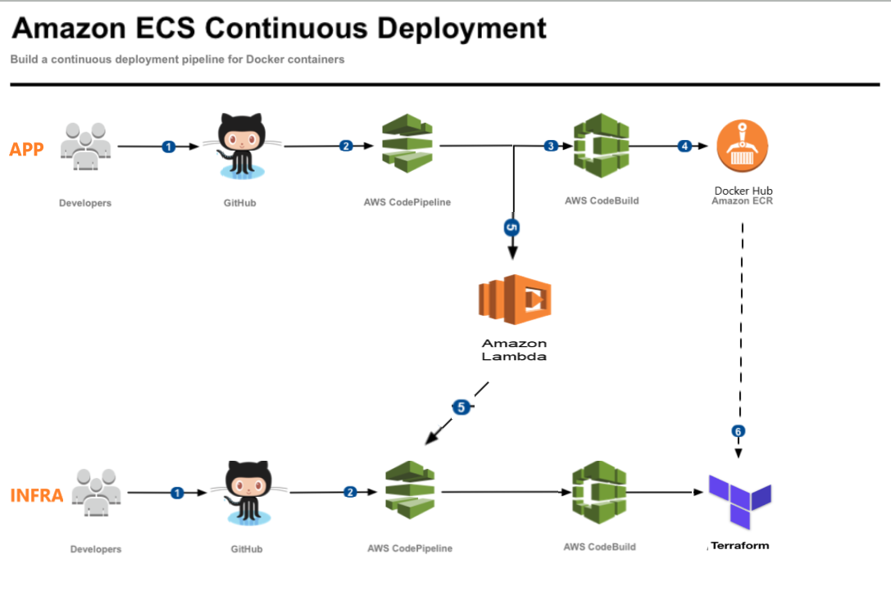

# Architecture
The AWS solution is depicted in the diagram below.

With this project you can create 2 code pipelines:
1) One of the pipelines can be used to create the necessary infrastructure (VPC, CodeBuild, ECS, Fargate) and do the new application deployments.
2) The other pipeline can be used to build the application docker image.

When the second pipeline has finished with building the application docker image, it should then trigger the first pipeline in order to deploy the new created docker image.
To trigger a new deployment of an ECS task definition a BUILD_ID is introduced in the task definition task and as an environment variable. This is a workaround because the origional ECS task definition uses the tag "latest" in the image name.

# Deployment Instructions
Use the shell scripts provided in the root of the project